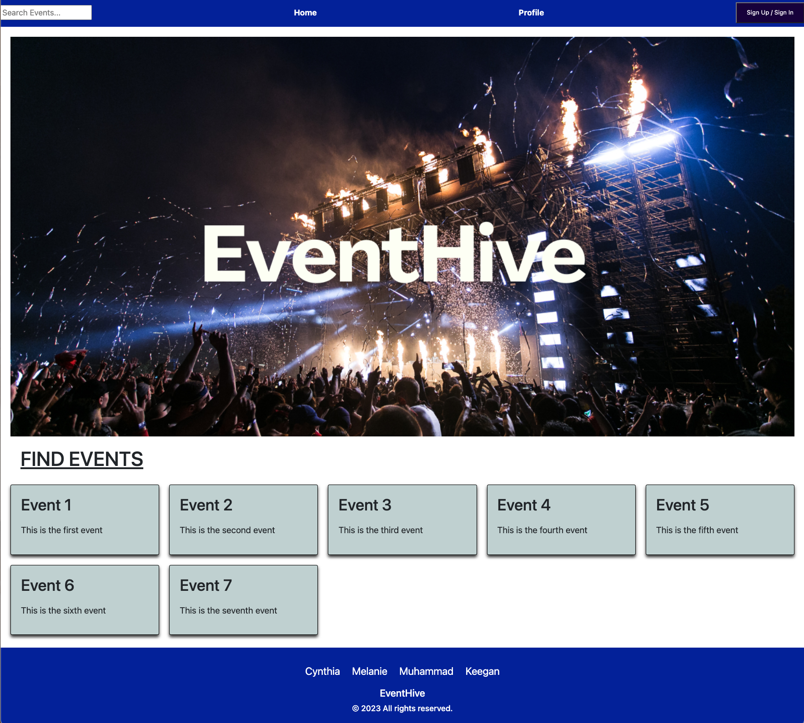

# EventHive

## Table of Contents

- [Description](#description)
- [User Story](#user-story)
- [Acceptance Criteria](#acceptance-criteria)
- [Preview Images](#preview-images) 
- [Link To Live URL](#link-to-live-url)
- [Installation and Usage](#installation-and-usage)
- [Tests](#tests)
- [Technologies Used](#technologies-used)
- [Credits](#credits)
- [License](#license)
- [Create React App](#create-react-app)

## Description

EventHive is a single-page application built using the MERN stack (MongoDB, Express, React, Node.js) that empowers users to create, manage, and attend events effortlessly. This document serves as a comprehensive guide to understand and use the application effectively.

EventHive is designed to streamline the process of event creation, management, and attendance. Users can easily sign up or log in to access the full functionality of the application. Once logged in, users can create events by providing essential details such as location, date, time, and category. Additionally, users can efficiently manage their events, including the ability to edit or delete them as needed.

## User Story

```md
As a user, I desire a secure and seamless experience on the application. I want the ability to:
Sign up, log in, and log out securely, ensuring the privacy and safety of my account information.
Create, add, delete, and edit events with essential details like location, date, time, and category, allowing me to manage my events effectively.
Browse events that are created by other users, and effortlessly filter them based on location, date, time, and category, to discover events that match my preferences.
Mark my attendance to events, ensuring proper coordination and communication with event organizers.
Easily view the events I am attending, so I can stay informed about the events I have committed to.
Experience a responsive and user-friendly interface, ensuring a smooth and enjoyable experience across different devices and screen sizes.
Access the application seamlessly on various devices, making it convenient to use on my preferred technology.
```

## Acceptance Criteria

```md
The application offers a secure authentication system, enabling users to sign up, log in, and log out with confidence.
Once logged in, users gain the ability to create events, providing all necessary details such as location, date, time, and category.
Managing events is made simple as users can easily add, delete, and edit their event listings.
Users can explore a wide range of events created by other users within the application.
To enhance the event browsing experience, users can efficiently filter events based on location, date, time, and category.
Users can conveniently mark their attendance to events, ensuring seamless planning and coordination.
The application boasts a polished and responsive user interface, guaranteeing an enjoyable and intuitive experience across various devices and screen sizes.
```

## Preview Images
- ## Preview - Home


## Link To Live URL

**Live Link** [Link To Live URL](https://) 
### this application is deployed live via GH-Pages, and can be accessed via the link above.

## Installation and Usage
- To clone the repo: https://github.com/cynthiamory/EventHive.git
- Install [Node](https://nodejs.org/en). version 16 and up. Command line: 
```bash
npm init
```
#### Install Dependencies the root of the directory using the command:
```bash
npm install
```
#### Run the application to initiate the server using Command at the root of the directory: 
```bash
npm run start
```

## Tests
- There are no tests yet for this application

## Technologies Used
Assignment was built with:


## Credits
- EventHive: Cynthia, Keegan, Muhammad & Melanie - Full Stack Developer Students.
- Institution: The University Of Toronto
- Course: Bootcamp Full Stack Development
- Instructor: Ali Masqood 
- TA: Shihan 
- Online Support: 
- License badges: Sheilds.io

## License


